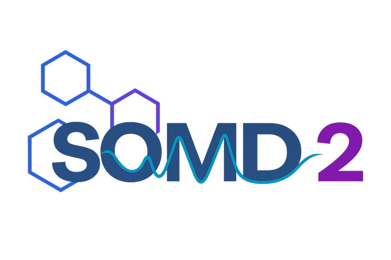

<p align="center">
    <picture align="center">
        
    </picture>
</p>

# SOMD2

[](https://github.com/openbiosim/somd2/actions/workflows/devel.yaml)
[](https://anaconda.org/openbiosim/somd2)
[](https://www.gnu.org/licenses/gpl-3.0)

Open-source GPU accelerated molecular dynamics engine for alchemical free-energy
simulations. Built on top of [Sire](https://github.com/OpenBioSim/sire) and [OpenMM](https://github.com/openmm/openmm). The code is still under active development and is not yet ready for general use.

## Installation

### Conda package

Install `somd2` directly from the `openbiosim` channel:

```
conda install -c conda-forge -c openbiosim somd2
```

Or, for the development version:

```
conda install -c conda-forge -c openbiosim/label/dev somd2
```

### Installing from source (standalone)

To install from source using [pixi](https://pixi.sh), which will
automatically create an environment with all required dependencies
(including pre-built [Sire](https://github.com/OpenBioSim/sire),
[BioSimSpace](https://github.com/OpenBioSim/biosimspace),
[Ghostly](https://github.com/OpenBioSim/ghostly), and
[Loch](https://github.com/OpenBioSim/loch)):

```
git clone https://github.com/openbiosim/somd2
cd somd2
pixi install
pixi shell
pip install -e .
```

### Installing from source (full OpenBioSim development)

If you are developing across the full OpenBioSim stack, first install
[Sire](https://github.com/OpenBioSim/sire) from source by following the
instructions [here](https://github.com/OpenBioSim/sire#installation), then
activate its pixi environment:

```
pixi shell --manifest-path /path/to/sire/pixi.toml -e dev
```

You may also need to install other packages from source, e.g.
[BioSimSpace](https://github.com/OpenBioSim/biosimspace),
[Ghostly](https://github.com/OpenBioSim/ghostly), and
[Loch](https://github.com/OpenBioSim/loch):

```
pip install -e /path/to/biosimspace
pip install -e /path/to/ghostly
pip install -e /path/to/loch
```

Then install `somd2` into the environment:

```
pip install -e .
```

> [!Note]
> Pixi does not run conda post-link scripts, so the `ocl-icd-system`
> symlink needed for OpenCL won't be created automatically. After
> creating the environment (or after a pixi update), run the following
> to fix this:
>
> ```bash
> pixi shell
> ln -sfn /etc/OpenCL/vendors "${CONDA_PREFIX}/etc/OpenCL/vendors/ocl-icd-system"
> ```

### Testing

You should now have a `somd2` executable in your path. To test, run:

```
somd2 --help
```

## Development

Pre-commit hooks are used to ensure consistent code formatting and linting.
To set up pre-commit in your development environment:

```
pixi shell -e dev
pre-commit install
```

This will run [ruff](https://docs.astral.sh/ruff/) formatting and linting
checks automatically on each commit. To run the checks manually against all
files:

```
pre-commit run --all-files
```

## Usage

In order to run an alchemical free-energy simulation you will need to
first create a stream file containing the _perturbable_ system of interest.
This can be created using [BioSimSpace](https://github.com/OpenBioSim/biosimspace).
For example, following the tutorial
[here](https://biosimspace.openbiosim.org/versions/2023.4.0/tutorials/hydration_freenrg.html).
Once the system is created, it can be streamed to file using, e.g.:

```python
import BioSimSpace as BSS

BSS.Stream.save(system, "perturbable_system")
```

You can then run a simulation with:

```
somd2 perturtbable_system.bss
```

The help message provides information on all of the supported options, along
with their default values. Options can be specified on the command line, or
using a YAML configuration file, passed with the `--config` option. Any options
explicity set on the command line will override those set via the config file.

An example perturbable system for a methane to ethanol perturbation in solvent
can be found [here](https://sire.openbiosim.org/m/merged_molecule.s3.bz2).
This is a `bzip2` compressed file that will need to be extracted before use.

#### Running SOMD2 using one or more GPUs

In order to run using GPUs you will first need to set the relevant environment
variable. For example, to run using 4 CUDA enabled GPUS set `CUDA_VISIBLE_DEVICES=0,1,2,3`
(for openCL and HIP use `OPENCL_VISIBLE_DEVICES` and `HIP_VISIBLE_DEVICES` respectively).

By default `SOMD2` will run using the CPU platform, however if the relevant
environment variable has been set (as above) the new platform will be detected
and set. In the case that this detection fails, or if there are multiple platforms
available, the `--platform` option can be set (for example `--platform cuda`).

By default, `SOMD2` will automatically manage the distribution of lambda windows
across all listed devices. In order to restrict the number of devices used
the `--max_gpus` option can be set, for example setting `max_gpus=2` while
`CUDA_VISIBLE_DEVICES` are set as above would restrict `SOMD2` to using only
GPUs 0 and 1.

## Replica exchange

`SOMD2` supports Hamiltonian replica exchange (HREX) simulations, which can be
enabled using the `--replica-exchange` option. Note that dynamics contexts will
be created up-front for all replicas, so this can be memory intensive. As such,
replica exchange is intended for use on multi-GPU nodes with a large amount of
memory. For optimal performance, it is recommended that the number of replicas
be a multiple of the number of GPUs. It is also possible to oversubscribe the
GPUs, i.e. have more than one replica running on a GPU at a time. This can be
controlled via the `--oversubscription-factor` option, e.g. a value of 2 would
allow 2 replicas to run on each GPU at a time.

The swap frequency for replica exchange is controlled by the `energy-frequency`
option, i.e. we compute the energies for all replicas at this frequency, then
attempt to mix the replicas. A larger value will improve performance, but may
reduce the efficiency of the exchange.

## REST2

We also support Replica Exchange with Solute Scaling
([REST2](https://pubs.acs.org/doi/10.1021/jp204407d)) simulations to facilitate sampling for perturbations
involving conformational changes, e.g.  ring flips. This can be enabled
using the `--rest2-scale` option, which specifies the "temperature" of the
REST2 region relative to the rest of the system. By default, the REST2 region
comprises _all_ atoms in perturbable molecules, but can be controlled via the
`--rest2-selection` option. This should be a `Sire` selection string that specifies
additional atoms of interest, i.e. those in regular, non-perturbable molecules.
If the selection does contain atoms within perturbable molecules, then only
those atoms within the perturbable molecules will be considered as part of the
REST2 region, i.e. you can select a sub-set of atoms within a perturbable
molecule to be scaled.

By default, the REST2 schedule is a triangular function that starts and ends
at 1.0, with a peak at the middle of the lambda schedule corresponding to
the value of `--rest2-scale`. By passing multiple values for `--rest2-scale`, the
user can fully control the schedule. When doing so, the number of values must
match the number of lambda windows.

## GCMC

SOMD2 also supports grand canonical Monte Carlo (GCMC) water sampling using
the [loch](https://github.com/OpenBioSim/loch) package. This can be enabled
using the `--gcmc` option. To define a GCMC region, use the `--gcmc-selection`
option, which should be a `Sire` selection string that specifies the atoms
defining the centre of geometry for the GCMC region. The radius of the GCMC
sphere can be controlled using the `--gcmc-radius` option. To see all GCMC
related options, run:

```
somd2 --help | grep -A2 '  --gcmc'
```

> [!NOTE]
> GCMC is only supported when using the CUDA or OpenCL platforms.

When using the CUDA platform, make sure that `nvcc` is in your `PATH`. If you
require a different `nvcc` to that provided by conda, you can set the
`PYCUDA_NVCC` environment variable to point to the desired `nvcc` binary.
Depending on your setup, you may also need to install the `cuda-nvvm` package
from `conda-forge`.

## Terminal ring flip Monte Carlo

SOMD2 supports terminal ring flip Monte Carlo (MC) moves to improve sampling
of terminal aromatic rings in perturbable ligands, as described in
[this paper](https://chemrxiv.org/doi/full/10.26434/chemrxiv-2025-2zkx5).
Each move attempts a discrete rotation of a terminal ring around the bond
connecting it to the rest of the molecule, accepted or rejected via the
Metropolis criterion. Terminal ring groups are detected automatically from
the molecular connectivity of perturbable molecules.

To enable terminal flip MC, set the frequency at which moves are attempted:

```
somd2 perturbable_system.bss --terminal-flip-frequency "1 ps"
```

The flip angle for each group is determined automatically from the ring
geometry. To override this for all groups:

```
somd2 perturbable_system.bss --terminal-flip-frequency "1 ps" --terminal-flip-angle "180 degrees"
```

## Debugging with energy components

To help diagnose simulation instabilities, `SOMD2` can record the potential
energy contribution from each OpenMM force group. This is enabled with the
`--save-energy-components` flag:

```
somd2 perturbable_system.bss --save-energy-components
```

One Parquet file per λ window is written to the output directory, named
`energy_components_<lambda>.parquet`. Times are in nanoseconds and energies in
kcal/mol; both are stored as schema metadata in the file.

The recording interval depends on the runner and active samplers:

- **Replica exchange**: always `energy-frequency`
- **Standard runner, no MC**: `energy-frequency`
- **Standard runner, with MC**: the shortest active MC frequency, i.e.
  `gcmc-frequency`, `terminal-flip-frequency`, or the smaller of the two
  when both are active

> [!NOTE]
> Energy components are written more frequently than checkpoint files and are
> not guarded by the file lock, so they may lead the checkpoint files by up
> to one `checkpoint-frequency` interval when copying output mid-simulation.

## Copying output files during a simulation

When `SOMD2` writes checkpoint files it acquires an exclusive
[file lock](https://py-filelock.readthedocs.io) on `somd2.lock` inside the output
directory. This guarantees that checkpoint files are always in a consistent
state on disk.

If you want to copy the output directory while a simulation is running (for
example, to create a backup or to inspect intermediate results), acquire the
same lock first so that you do not copy files mid-write. On Linux/macOS this
can be done with the `flock` command:

```bash
flock /path/to/output/somd2.lock cp -r /path/to/output /destination
```

Or from Python using the [filelock](https://pypi.org/project/filelock/) package
(which `somd2` already depends on):

```python
from filelock import FileLock

with FileLock("/path/to/output/somd2.lock"):
    # copy files here
    ...
```

> [!NOTE]
> The `--timeout` option (default: `300 s`) controls how long `SOMD2` will
> wait to re-acquire the lock after your copy completes. If you hold the lock
> for longer than this, the simulation will raise a `Timeout` error.

## Analysis

Simulation output will be written to the directory specified using the
`--output-directory` parameter. This will contain a number of files, including
[Parquet files](https://en.wikipedia.org/wiki/Apache_Parquet) for the energy
trajectories of each λ window. These can be processed using
[BioSimSpace](https://github.com/OpenBioSim/biosimspace) as follows:

```python
import BioSimSpace as BSS

pmf1, overlap1 = BSS.FreeEnergy.Relative.analyse("output1")
```

(Here we assume that the output directory is called `output1`.)

To compute the relative free-energy difference between two legs, e.g.
legs 1 and 2, you can use:

```python
pmf2, overlap2 = BSS.FreeEnergy.Relative.analyse("output2")

free_nrg = BSS.FreeEnergy.Relative.difference(pmf1, pmf2)
```

## Truncated MBAR analysis

When running HREX with a large number of replicas it can become computationally
expensive to compute energies. (We need the energies of each replica at each
lamdba value.) As a shortcut, it's possible to truncate the neighbourhood of
windows for which we compute energies, then use a large null energy for the
remaining windows. This can be controlled via the `--num-energy-neighbours` option.
For example, setting this to 2 would compute energies for the current window and
its two neighbours on either side. The value assigned to the remaining windows
can be controlled via the `--null-energy` option. The number of neighbours should
be chosen as a trade off between accuracy and computational cost. A value of around
20% of the number of replicas has been found to be a good starting point.

## Ghost atom modifications

We support modification of ghost atom bonded terms to avoid spurious coupling
to the physical system using the approach described in
[this](https://pubs.acs.org/doi/10.1021/acs.jctc.0c01328) paper.
These are enabled by default, but can be disabled using the ``--no-ghost-modifications``
option. Modifications are implemented using the [ghostly](https://gitbub.com/OpenBioSim/ghostly)
package.

## Note for SOMD1 users

For existing users of `somd1`, it's possible to generate input for `somd2` by passing
`--somd2 True` to the `prepareFEP.py` setup script. This will write a `somd2` compatible
stream file.

Additionally, `somd2` can be run in `somd1` _compatibility_ mode by passing the
``--somd1-compatibility`` command-line option to the `somd2` executable. This ensures
that the perturbation used is consistent with the approach from `somd1`, i.e.
it uses the same modifications for bonded-terms involving dummy atoms as `somd1`.

Finally, it is also possible to run `somd2` using an existing `somd1` perturbation
file. To do so, you will also need to create a stream file representating the
λ = 0 state. For existing input generated by `prepareFEP.py`, this can be done as
follows. (This assumes that the output has a prefix `somd1`.)

```python
import BioSimSpace as BSS

# Load the lambda = 0 state from prepareFEP.py
system = BSS.IO.readMolecules(["somd1.prm7", "somd1.rst7"], reduce_box=True)

# Write a stream file.
BSS.Stream.save(system, "somd1")
```

(This will write a stream file called `somd1.bss`.)

This can then be run with `somd2` using the following:

```
somd2 somd1.bss --pert-file somd1.pert --somd1-compatibility
```

(This only shows the limited options required. Others will take default values and can be set accordingly.)

If you want to load an existing system from a perturbation file and use the
new `somd2` [ghost atom bonded-term modifications](https://github.com/OpenBioSim/ghostly),
then simply omit the `--somd1-compatibility` option.

## GPU oversubscription

If you have an NVIDIA GPU that supports the multi-process service (MPS), you can
oversubscibe the GPU to run multiple OpenMM contexts on the same GPU at once,
increasing the throughput of your simulation. To do this, you will need to first
enable MPS by running the following command:

```
nvidia-cuda-mps-control -d
```

The number of contexts that can be run in parallel is then controlled by the
`--oversubscription-factor` option, which defaults to 1.

More details on MPS, including tuning options, can be found in the following
[techical blog](https://developer.nvidia.com/blog/maximizing-openmm-molecular-dynamics-throughput-with-nvidia-multi-process-service/).

## Python API

`SOMD2` can also be used as a Python API, allowing it to be embedded
within other Python scripts.

## Known issues

If using the regular `Runner` class via the Python API, then you will need to
guard calls to its `run()` method within a `if __name__ == "__main__":` block
since it uses multiprocessing with the `spawn` start method.

During a checkpoint cycle trajectory frames are stored in memory before being
paged to disk. When running replica exchange simulations with a large number
of replicas this can lead to exceeding the temporary file storage limit on
some systems, causing the simulation to hang. This can be resolved by either
reducing the frequency at which frames are stored, or checkpointing more
frequently. (Frames are written to disk and cleared from memory at each
checkpoint.)
