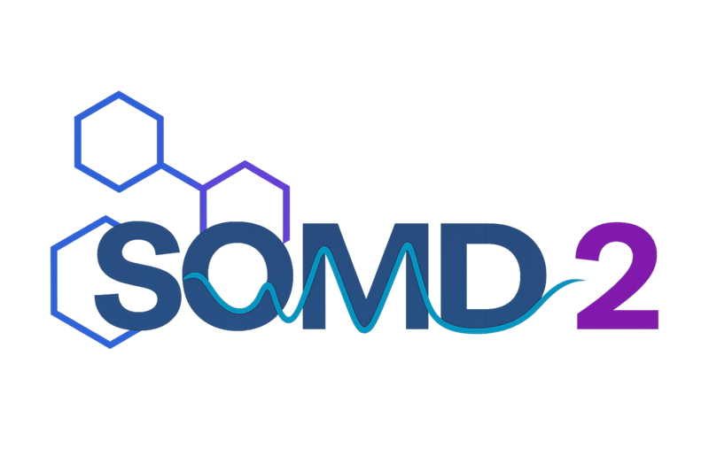

<p align="center">
    <picture align="center">
        
    </picture>
</p>

# SOMD2

[](https://github.com/openbiosim/somd2/actions/workflows/devel.yaml)
[](https://anaconda.org/openbiosim/somd2)
[](https://www.gnu.org/licenses/gpl-3.0)

Open-source GPU accelerated molecular dynamics engine for alchemical free-energy
simulations. Built on top of [Sire](https://github.com/OpenBioSim/sire) and
[OpenMM](https://github.com/openmm/openmm).

<a id="features"></a>

## ✨ Features

- 🧬 **Perturbations**: relative binding free energies,
  [absolute binding free energies](#absolute-binding-free-energies),
  [ring-breaking](#ring-breaking-perturbations),
  [charge-change](#charge-change-perturbations), and protein mutations.
- 💧 **[GCMC](#gcmc)**: grand canonical Monte Carlo water sampling.
- 🔁 **[Replica exchange](#replica-exchange)**: Hamiltonian replica exchange
  between λ windows.
- 🌡️ **[REST2](#rest2)**: replica exchange with solute scaling.
- 🔄 **[Terminal ring flips](#terminal-ring-flip-monte-carlo)**: Monte Carlo
  moves to improve sampling of terminal aromatic rings.
- 👻 **[Ghost atom modifications](#ghost-atom-modifications)**: modification of
  ghost atom bonded terms to avoid spurious coupling to the physical system.
- 🖥️ **[Multiple GPUs](#running-somd2-using-one-or-more-gpus)**: λ windows are
  distributed across the available devices, with optional
  [oversubscription](#gpu-oversubscription).
- 💾 **[Restarts](#restarting)**: simulations are checkpointed and can be
  continued from their output directory, e.g. after a crash or a job time
  limit, or to extend an existing simulation.
- 🎛️ **[PME tuning](#pme-tuning)**: automatic choice of the smallest PME grid
  that meets the requested accuracy, for faster simulations on CUDA and OpenCL.
- 📊 **[Viewer](#viewer)**: a web page for monitoring simulations as they run
  and analysing their results.
- 📋 **[Command-line summary](#summary-from-the-command-line)**: the progress
  and free energies of a campaign as tables, CSV or JSON, without the viewer.

<a id="installation"></a>

## 📦 Installation

<a id="conda-package"></a>

### 🐍 Conda package

Install `somd2` directly from the `openbiosim` channel:

```
conda install -c conda-forge -c openbiosim somd2
```

Or, for the development version:

```
conda install -c conda-forge -c openbiosim/label/dev somd2
```

> [!NOTE]
> The README on the [`devel`](https://github.com/OpenBioSim/somd2/tree/devel)
> branch describes the development version, so during a development cycle it
> may mention features that aren't yet in the latest release. The README on the
> [`main`](https://github.com/OpenBioSim/somd2/tree/main) branch matches the
> latest release.

<a id="installing-from-source-standalone"></a>

### 🛠️ Installing from source (standalone)

To install from source using [pixi](https://pixi.sh), which will
automatically create an environment with all required dependencies
(including pre-built [Sire](https://github.com/OpenBioSim/sire),
[BioSimSpace](https://github.com/OpenBioSim/biosimspace),
[Ghostly](https://github.com/OpenBioSim/ghostly), and
[Loch](https://github.com/OpenBioSim/loch)):

```
git clone https://github.com/openbiosim/somd2
cd somd2
pixi install
pixi shell
pip install -e .
```

<a id="installing-from-source-full-openbiosim-development"></a>

### 🧰 Installing from source (full OpenBioSim development)

If you are developing across the full OpenBioSim stack, first install
[Sire](https://github.com/OpenBioSim/sire) from source by following the
instructions [here](https://github.com/OpenBioSim/sire#installation), then
activate its pixi environment:

```
pixi shell --manifest-path /path/to/sire/pixi.toml -e dev
```

You may also need to install other packages from source, e.g.
[BioSimSpace](https://github.com/OpenBioSim/biosimspace),
[Ghostly](https://github.com/OpenBioSim/ghostly), and
[Loch](https://github.com/OpenBioSim/loch):

```
pip install -e /path/to/biosimspace
pip install -e /path/to/ghostly
pip install -e /path/to/loch
```

Then install `somd2` into the environment:

```
pip install -e .
```

> [!IMPORTANT]
> Pixi does not run conda post-link scripts, so the `ocl-icd-system`
> symlink needed for OpenCL won't be created automatically. After
> creating the environment (or after a pixi update), run the following
> to fix this:
>
> ```bash
> pixi shell
> ln -sfn /etc/OpenCL/vendors "${CONDA_PREFIX}/etc/OpenCL/vendors/ocl-icd-system"
> ```

<a id="checking-the-installation"></a>

### ✅ Checking the installation

You should now have a `somd2` executable in your path. To check, run:

```
somd2 --help
```

<a id="keeping-up-to-date"></a>

### 🔃 Keeping up to date

During a development cycle the OpenBioSim packages are pinned only to a
`YYYY.N.0.dev` version, not to a specific build. `somd2` and its dependencies
therefore need to be kept in sync, so always update the whole stack together
rather than `somd2` alone.

For a conda install, update everything in one go:

```
conda update -c conda-forge -c openbiosim/label/dev sire biosimspace ghostly loch somd2
```

For a standalone pixi install, pull the latest `somd2` and refresh the
pre-built dependencies:

```
git pull
pixi update
```

For a full source install, `git pull` in *every* repository you have installed
(`sire`, `biosimspace`, `ghostly`, `loch` and `somd2`), not just `somd2`. Since
`sire` is compiled, you will also need to rebuild it.

<a id="development"></a>

## 👩‍💻 Development

Pre-commit hooks are used to ensure consistent code formatting and linting.
To set up pre-commit in your development environment:

```
pixi shell -e dev
pre-commit install
```

This will run [ruff](https://docs.astral.sh/ruff/) formatting and linting
checks automatically on each commit. To run the checks manually against all
files:

```
pre-commit run --all-files
```

<a id="running-the-tests"></a>

### 🧪 Running the tests

The tests can be run from the root of the repository with:

```
python -m pytest tests
```

Tests that need a GPU, e.g. those for GCMC, are skipped unless
`CUDA_VISIBLE_DEVICES` is set. The GCMC kernels are compiled when they are
first used, so `nvcc` must also be in your `PATH`, or be given with the
`PYCUDA_NVCC` environment variable. For example, with CUDA installed in
`/opt/cuda`:

```
CUDA_VISIBLE_DEVICES=0 PATH=/opt/cuda/bin:$PATH python -m pytest tests
```

Packages are only published once the tests have passed, so this is only needed
when developing SOMD2.

<a id="usage"></a>

## 🚀 Usage

To run an alchemical free-energy simulation, you first need a stream file
containing the *perturbable* system of interest. This can be created with
[BioSimSpace](https://github.com/OpenBioSim/biosimspace), e.g. by following its
[hydration free energy tutorial](https://biosimspace.openbiosim.org/tutorials/hydration_freenrg.html),
then saved with:

```python
import BioSimSpace as BSS

BSS.Stream.save(system, "perturbable_system")
```

For absolute binding free energies, the system can instead be created directly
with Sire, as described [below](#absolute-binding-free-energies). You can then
run a simulation with:

```
somd2 perturbable_system.bss
```

The help message provides information on all of the supported options, along
with their default values. Options can be specified on the command line, or
using a YAML configuration file, passed with the `--config` option. Any options
explicitly set on the command line will override those set via the config file.

An example perturbable system, for an ethane to methanol perturbation in
solvent, can be found [here](https://sire.openbiosim.org/m/merged_molecule.s3.bz2).
It is compressed with `bzip2`, so must be extracted before use.

A larger collection of input files and end-to-end tutorials, covering everything
from a simple charge-change validation system to full case studies, can be found
in the [somd2_examples](https://github.com/OpenBioSim/somd2_examples) repository.

<a id="running-somd2-using-one-or-more-gpus"></a>

### 🖥️ Running SOMD2 using one or more GPUs

To run on GPUs, list the devices in the relevant environment variable. This is
always required, since SOMD2 finds the devices to run on from the variable
itself. For example, to run on 4 CUDA GPUs, set `CUDA_VISIBLE_DEVICES=0,1,2,3`.
For OpenCL and HIP, use `OPENCL_VISIBLE_DEVICES` and `HIP_VISIBLE_DEVICES`
instead.

SOMD2 uses `--platform auto` by default, which selects the first platform
registered by OpenMM in order of preference: CUDA, OpenCL, HIP, Metal,
Reference, then CPU. If detection fails, or you want a specific platform, use
the `--platform` option, e.g. `--platform cuda`.

The λ windows are distributed across all of the listed devices automatically.
To use fewer of them, set `--max-gpus`, e.g. `--max-gpus 2` with
`CUDA_VISIBLE_DEVICES` set as above restricts SOMD2 to GPUs 0 and 1.

<a id="restarting"></a>

## 💾 Restarting

A simulation can be continued from the files in its output directory using the
`--restart` option:

```
somd2 perturbable_system.bss --restart --output-directory output
```

Each λ window (or replica) resumes from its most recent checkpoint. Restarting
requires the `config.yaml` file in the output directory, which records the
configuration of the original run so that the new one can be validated against
it. It is always written, unless `--no-write-config` is passed.

Only a limited set of options may be changed on restart. Broadly, anything that
would change the perturbation or the Hamiltonian is fixed, whereas options
controlling how long to run for, what to write out, and which hardware to use
can be varied. The most useful of these is `--runtime`, which allows a completed
simulation to be extended. SOMD2 will tell you which option is at fault if you
change one that isn't allowed.

> [!TIP]
> If the most recent checkpoint files are incomplete or corrupt, for example
> when recovering from a crash, pass `--use-backup` to restart from the last
> but one checkpoint instead.

<a id="hydrogen-mass-repartitioning"></a>

## ⚖️ Hydrogen mass repartitioning

By default SOMD2 applies hydrogen mass repartitioning (HMR), scaling hydrogen
masses by the factor given by `--h-mass-factor` (default 1.5). This is what
allows the default `--timestep` of 4 fs.

If the masses of your input system have already been repartitioned, or you want
to use a different repartitioning scheme, pass `--no-hmr` so that the masses of
the input system are used as they are.

> [!CAUTION]
> A 4 fs timestep is not stable without repartitioning, so if you disable HMR
> you will need to reduce `--timestep` accordingly, or supply a system that has
> already been repartitioned.

<a id="pme-tuning"></a>

## 🎛️ PME tuning

The PME parameters that OpenMM chooses from the Ewald error tolerance often use
a finer reciprocal-space grid than is needed for the requested accuracy. On the
CUDA and OpenCL platforms SOMD2 therefore tunes the PME parameters at the start
of a simulation, choosing the smallest grid, and the splitting parameter for it,
that is at least as accurate as the parameters OpenMM chooses from SOMD2's
error tolerance (see `--pme-tolerance` below). This takes tens of
seconds, and the chosen parameters and their relative force error are logged.
The speedup depends on the system and cutoff, and is largest at shorter cutoffs,
such as the default of 9 Å, where more of the work is done on the grid.

The tuned parameters are saved to `pme_parameters.yaml` in the output directory
and reused when the simulation is restarted, including on different hardware.
Restarts of simulations that were run without tuning carry on using the default
parameters.

Tuning can be disabled with `--no-tune-pme`. The accuracy that tuning must match
is set by the Ewald error tolerance, `--pme-tolerance` (default 1e-4), so a
looser tolerance allows a coarser grid. Alternatively, the PME parameters can
be set explicitly with either `--pme-grid`, the grid size, or `--pme-spacing`,
the maximum grid spacing, e.g. `--pme-spacing "0.12 nm"`, optionally along with
`--pme-alpha`, the splitting parameter in inverse nanometers. If `--pme-alpha`
isn't set it is derived from the tolerance. Tuning is skipped when any of these
are set.

<a id="replica-exchange"></a>

## 🔁 Replica exchange

SOMD2 supports Hamiltonian replica exchange (HREX) simulations, which can be
enabled using the `--replica-exchange` option. By default, a dynamics context is
created up-front for every replica, so replica exchange is memory intensive and
best suited to multi-GPU nodes.

The GPUs can also be oversubscribed, i.e. run more than one replica at a time,
using the `--oversubscription-factor` option, e.g. a value of 2 runs 2 replicas
on each GPU at once. This requires the NVIDIA multi-process service (MPS) to be
enabled. See [GPU oversubscription](#gpu-oversubscription) below.

If the replicas you want don't fit in GPU memory, use the `--max-contexts`
option to cap the number of contexts that are created. Each context is then
re-used to propagate several replicas per cycle, changing its λ value as it
goes, so the number of replicas is no longer limited by memory. For example,
`--num-lambda 24 --max-contexts 4` runs 24 replicas using the memory of 4. This
costs some performance, since the replicas sharing a context run one after
another rather than at the same time, so only use it when one context per
replica won't fit. When contexts are re-used, `--frame-frequency` must equal
`--checkpoint-frequency`.

For optimal performance, it is recommended that the number of contexts, i.e. the
number of replicas, or `--max-contexts` if it is set, be a multiple of the number
of GPUs, and no smaller than the number of GPUs multiplied by the
oversubscription factor. SOMD2 will warn you if this isn't the case.

Changing the λ value of a context requires it to be reinitialised whenever a
constrained bond length actually perturbs with λ, which is slow. This is a
limitation of OpenMM rather than of the approach, and a fix is being discussed
[here](https://github.com/openmm/openmm/issues/5439). In the meantime, if this
overhead is significant, pass `--no-update-constraints` to freeze the
constrained bond lengths at those of a single λ value, chosen with
`--constraint-lambda-index`. Both options are ignored unless contexts are being
re-used.

The swap frequency for replica exchange is controlled by the
`--energy-frequency` option: the energies of all replicas are computed at this
frequency, then swaps between them are attempted. A larger value improves
performance, but may reduce the efficiency of the exchange.

<a id="rest2"></a>

## 🌡️ REST2

SOMD2 also supports replica exchange with solute scaling
([REST2](https://pubs.acs.org/doi/10.1021/jp204407d)), to improve sampling for
perturbations involving conformational changes, e.g. ring flips. It is enabled
with the `--rest2-scale` option, which specifies the "temperature" of the REST2
region relative to the rest of the system.

By default, the REST2 region comprises *all* atoms in perturbable molecules.
Atoms in other, non-perturbable molecules can be added with `--rest2-selection`,
a `Sire` selection string. If the selection includes atoms in perturbable
molecules, only the selected atoms of those molecules are scaled, so a subset of
a perturbable molecule can be chosen.

The REST2 schedule is a triangular function that starts and ends at 1.0,
peaking at the value of `--rest2-scale` in the middle of the λ schedule.
Passing multiple values to `--rest2-scale` gives full control of the schedule,
in which case there must be one value for each λ window.

<a id="gcmc"></a>

## 💧 GCMC

SOMD2 also supports grand canonical Monte Carlo (GCMC) water sampling using
the [loch](https://github.com/OpenBioSim/loch) package. This can be enabled
using the `--gcmc` option. To define a GCMC region, use the `--gcmc-selection`
option, which should be a `Sire` selection string that specifies the atoms
defining the centre of geometry for the GCMC region. The radius of the GCMC
sphere can be controlled using the `--gcmc-radius` option. To see all GCMC
related options, run:

```
somd2 --help | grep -A2 '  --gcmc'
```

> [!IMPORTANT]
> GCMC is only supported when using the CUDA or OpenCL platforms.

When using the CUDA platform, make sure that `nvcc` is in your `PATH`. If you
require a different `nvcc` to that provided by conda, you can set the
`PYCUDA_NVCC` environment variable to point to the desired `nvcc` binary.
Depending on your setup, you may also need to install the `cuda-nvvm` package
from `conda-forge`.

<a id="terminal-ring-flip-monte-carlo"></a>

## 🔄 Terminal ring flip Monte Carlo

SOMD2 supports terminal ring flip Monte Carlo (MC) moves to improve sampling
of terminal aromatic rings in perturbable ligands, as described in
[this paper](https://doi.org/10.26434/chemrxiv-2025-2zkx5).
Each move attempts a discrete rotation of a terminal ring around the bond
connecting it to the rest of the molecule, accepted or rejected via the
Metropolis criterion. Terminal ring groups are detected automatically from
the molecular connectivity of perturbable molecules.

To enable terminal flip MC, set the frequency at which moves are attempted:

```
somd2 perturbable_system.bss --terminal-flip-frequency "1 ps"
```

The flip angle for each group is determined automatically from the ring
geometry. To override this for all groups:

```
somd2 perturbable_system.bss --terminal-flip-frequency "1 ps" --terminal-flip-angle "180 degrees"
```

<a id="ghost-atom-modifications"></a>

## 👻 Ghost atom modifications

SOMD2 modifies the bonded terms of ghost atoms to avoid spurious coupling to the
physical system, using the approach described in
[this paper](https://pubs.acs.org/doi/10.1021/acs.jctc.0c01328). The
modifications are made with the [ghostly](https://github.com/OpenBioSim/ghostly)
package, and are enabled by default, but can be disabled with
`--no-ghost-modifications`.

<a id="lambda-schedules"></a>

## 📈 Lambda schedules

How the perturbation is applied along the λ coordinate is controlled by the
`--lambda-schedule` option. The default, `standard_morph`, is intended for
relative binding free energy (RBFE) simulations. The available schedules are:

| Schedule | Description |
| --- | --- |
| `standard_morph` | Linear interpolation between the two end states. |
| `charge_scaled_morph` | As above, but with charges scaled at intermediate λ values. |
| `annihilate` | Absolute binding or hydration free energies, removing all non-bonded interactions. |
| `decouple` | Absolute binding or hydration free energies, removing only intermolecular interactions. |
| `ring_break_morph` | Ring-breaking perturbations. |
| `reverse_ring_break_morph` | Ring-making perturbations, i.e. the reverse of the above. |

For the `annihilate`, `decouple`, and ring-breaking schedules, appropriate
restraints can be generated automatically. See the sections below.

<a id="absolute-binding-free-energies"></a>

## 🧬 Absolute binding free energies

Absolute binding free energy (ABFE) calculations are supported using the
`annihilate` and `decouple` λ schedules. Both first discharge the ligand, then
remove its Lennard-Jones interactions: `annihilate` removes all non-bonded
interactions, including those within the ligand, whereas `decouple` retains the
intramolecular terms.

Unlike RBFE, no atom mapping is needed to set up an ABFE calculation, so the
perturbable system can be created directly with
[Sire](https://github.com/OpenBioSim/sire). Load the system for each leg, i.e.
the ligand in the protein-ligand complex (bound) and in solvent (free), then
decouple the ligand and update the system with the result:

```python
import sire as sr

mols = sr.load("system.prm7", "system.rst7")

mol = sr.morph.decouple(mols["resname LIG"], as_new_molecule=False)
mols.update(mol)

sr.stream.save(mols, "bound.s3")
```

Here `resname LIG` is a `Sire` selection string for the ligand; adjust it to
match your system. The ligand is now a perturbable molecule, and the system can
be run with either schedule:

```
somd2 bound.s3 --lambda-schedule decouple
```

The ligand must be restrained within the binding site. If no restraints are
passed, a Boresch restraint is generated automatically for the bound leg, i.e.
when the system contains a protein as well as the ligand and water. This is
done by minimising the system, running a short trajectory at λ = 0, then
choosing the anchor atoms and force constants from it. The length of this
trajectory and the frequency at which frames are saved can be controlled with
the `--restraint-search-time` and `--restraint-search-frequency` options. By
default the receptor anchor atoms are chosen from the protein backbone; use
`--restraint-search-receptor-selection` to pass a `Sire` selection string
instead.

The restraint is written to `abfe_restraint.s3` in the output directory and is
reloaded on restart, since the accumulated free energy corresponds to that
particular restraint. The standard state correction is logged and written to
the metadata of the energy trajectory, so analysis code can apply it without
needing to scan the log.

> [!NOTE]
> The Beutler soft-core form, enabled with `--softcore-form beutler`, is only
> supported with the ABFE schedules, or a custom schedule.

<a id="ring-breaking-perturbations"></a>

## 🧬 Ring-breaking perturbations

Perturbations that break (or form) a ring are supported using the
`ring_break_morph` schedule, or `reverse_ring_break_morph` for the ring-making
direction.

```
somd2 perturbable_system.bss --lambda-schedule ring_break_morph
```

These perturbations require a pair of Morse restraints on the atoms of the bond
that is broken. If no restraints are passed, both are generated automatically.
A "hard" Morse potential replaces the harmonic bond, inheriting its force
constant and equilibrium length, and is switched off as a weaker "soft" Morse
restraint holds the fragment in place. Their well depths and the force constant
of the soft restraint can be controlled with the `--morse-hard-well-depth`,
`--morse-soft-well-depth`, and `--morse-soft-force-constant` options.

Unlike the ABFE restraints, these are regenerated on each run rather than being
cached, since they are derived from the bond parameters alone and are therefore
identical every time.

> [!TIP]
> The defaults are a reasonable starting point, but ring-breaking perturbations
> are demanding. A non-uniform spacing of λ values, set with `--lambda-values`,
> is typically needed to obtain good overlap around the point at which the bond
> is broken. The [alchemate](https://github.com/akalpokas/alchemate) package
> provides workflows for iteratively optimising the λ schedule.

<a id="charge-change-perturbations"></a>

## 🧬 Charge-change perturbations

Perturbations that change the net charge of the system are handled
automatically using the co-alchemical ion method. The charge difference between
the two end states is computed when the system is loaded, and, if it is
non-zero, a number of water molecules equal to the absolute charge difference
are perturbed into counter-ions alongside the main perturbation, keeping the
total charge constant at every λ value. The waters furthest from the
perturbable molecule are chosen, and the ion type is picked to offset the charge
change, re-using the parameters of a free ion already present in the system
where possible.

No options are needed to enable this. The automatically detected value can be
overridden with `--charge-difference`, which takes the perturbed charge minus
the reference charge:

```
somd2 perturbable_system.bss --charge-difference -1
```

The molecules chosen as alchemical ions are written to `alchemical_ions.npz` in
the output directory and reused on restart, so that ion selection does not
depend on anything that might have changed between runs.

Since a co-alchemical ion is only meaningful in the bulk, SOMD2 can restrain it
away from the perturbable region. Passing a distance to
`--coalchemical-restraint-dist` adds an inverse-distance restraint between each
ion and the atom closest to the centre of geometry of the perturbable molecule,
preventing the ion from drifting into the binding site and interacting with the
protein or ligand:

```
somd2 perturbable_system.bss --coalchemical-restraint-dist "10 A"
```

> [!NOTE]
> These restraints are *added* to any others in use. Restraints passed via the
> Python API, and those generated automatically for the ABFE and ring-breaking
> schedules described above, are all retained.

<a id="debugging-with-energy-components"></a>

## 🐞 Debugging with energy components

To help diagnose simulation instabilities, SOMD2 can record the potential
energy contribution from each OpenMM force group. This is enabled with the
`--save-energy-components` flag:

```
somd2 perturbable_system.bss --save-energy-components
```

One Parquet file per λ window is written to the output directory, named
`energy_components_<lambda>.parquet`. Times are in nanoseconds and energies in
kcal/mol; both are stored as schema metadata in the file.

The recording interval depends on the runner and active samplers:

- **Replica exchange**: always `energy-frequency`
- **Standard runner, no MC**: `energy-frequency`
- **Standard runner, with MC**: the shortest active MC frequency, i.e.
  `gcmc-frequency`, `terminal-flip-frequency`, or the smaller of the two
  when both are active

> [!NOTE]
> Energy components are written more frequently than checkpoint files and are
> not guarded by the file lock, so they may lead the checkpoint files by up
> to one `checkpoint-frequency` interval when copying output mid-simulation.

<a id="copying-output-files-during-a-simulation"></a>

## 📋 Copying output files during a simulation

When SOMD2 writes checkpoint files it acquires an exclusive
[file lock](https://py-filelock.readthedocs.io) on `somd2.lock` inside the output
directory. This guarantees that checkpoint files are always in a consistent
state on disk.

If you want to copy the output directory while a simulation is running (for
example, to create a backup or to inspect intermediate results), acquire the
same lock first so that you do not copy files mid-write. On Linux/macOS this
can be done with the `flock` command:

```bash
flock /path/to/output/somd2.lock cp -r /path/to/output /destination
```

Or from Python using the [filelock](https://pypi.org/project/filelock/) package
(which `somd2` already depends on):

```python
from filelock import FileLock

with FileLock("/path/to/output/somd2.lock"):
    # copy files here
    ...
```

> [!CAUTION]
> The `--timeout` option (default: `300 s`) controls how long SOMD2 will
> wait to re-acquire the lock after your copy completes. If you hold the lock
> for longer than this, the simulation will raise a `Timeout` error.

<a id="analysis"></a>

## 🧮 Analysis

Simulation output is written to the directory given by `--output-directory`.
This contains a number of files, including
[Parquet files](https://en.wikipedia.org/wiki/Apache_Parquet) for the energy
trajectories of each λ window. These can be analysed with
[BioSimSpace](https://github.com/OpenBioSim/biosimspace), e.g. for an output
directory called `output1`:

```python
import BioSimSpace as BSS

pmf1, overlap1 = BSS.FreeEnergy.Relative.analyse("output1")
```

The free-energy difference between two legs, e.g. the bound and free legs of a
perturbation, can then be computed from their PMFs:

```python
pmf2, overlap2 = BSS.FreeEnergy.Relative.analyse("output2")

free_nrg = BSS.FreeEnergy.Relative.difference(pmf1, pmf2)
```

The [viewer](#viewer) and [`somd2-summary`](#summary-from-the-command-line) also
run this analysis, and pair the legs of each perturbation automatically.

<a id="viewer"></a>

## 📊 Viewer

SOMD2 includes a web viewer for monitoring and analysing simulations, either
while they are running or once they are complete. To view one or more output
directories, run:

```
somd2-view output1 output2
```

Then open `http://127.0.0.1:8000` in a browser. A path can also be a directory
containing several output directories, e.g. the bound and free legs of a
perturbation, in which case all of them will be listed. Use `--port` to choose
a different port and `--open` to open a browser automatically.

New output directories are picked up while the viewer is running, so a whole
campaign can be monitored by pointing the viewer at a single parent directory,
even an empty one, before any jobs have started. Each simulation appears once it
starts writing output.

The viewer shows:

- Progress, simulation speed, and an estimate of the time remaining, along with
  any recent warnings or errors from the log file.
- Depictions of the perturbed molecules at each end state, in the style of
  BioSimSpace's `viewMapping`, highlighting the atoms that are unique to each end
  state, i.e. ghosts at the other, or that change element.
- An interactive 3D view of the same molecules, using a conformer generated with
  RDKit. The end states are aligned on their mapped atoms, so switching between
  them shows what changes. Stereochemistry is taken from the first saved
  coordinates, and flagged as unknown until there are some. This uses
  [3Dmol.js](https://3dmol.org), which is included with the viewer under its
  BSD-3-Clause licence.
- For a bound leg, the binding site from the latest saved coordinates of the
  λ = 0 window, with the protein as a cartoon and the residues around the
  perturbed molecule in detail. It is updated as the simulation runs.
- For a protein mutation, in place of the above, the protein at each end state
  from the latest saved coordinates of its window, with the mutated residues
  and any ligand in detail.
- The MBAR free energy, PMF, overlap matrix, and forward and backward
  convergence. These are updated in the background as new data is written. For
  ABFE simulations, the standard state correction for the Boresch restraint is
  also shown.
- Replica exchange statistics, i.e. the transition matrix, neighbour swap
  acceptance, replica state trajectories, and round trips.
- Energy components as a function of time for each λ window. These are
  written at each checkpoint, or at every energy sample when using
  `--save-energy-components`.
- GCMC and terminal flip Monte Carlo statistics, if active.
- Any restraints, e.g. a Boresch restraint for an ABFE simulation, or Morse
  restraints for a ring-breaking perturbation.
- The λ schedule, REST2 scale factors, configuration options, and tuned PME
  parameters.

The page refreshes automatically, with the interval set in the header.
Sections can be collapsed by clicking their heading.

Use the "Save as PDF" button to create a report of a simulation, e.g. to attach
to a GitHub issue alongside the input needed to reproduce a problem. Collapsed
sections are left out of the PDF, so sensitive content, such as the structures
of proprietary molecules, can be hidden before saving.

When the viewer finds related simulations, a summary page is added to the top
of the list of runs. Repeats of the same simulation are grouped, using the
end-state topologies and the options that can't change on restart, and their
free energies averaged, with a standard error. Potential problems are
highlighted for each simulation, e.g. stopped runs, poor overlap or replica
mixing, or repeats that disagree, so problematic edges can be spotted early in a
campaign. Results are updated in the background while the summary page is open.

The bound and free legs of the same perturbation are paired to give the
relative binding free energy, or the absolute binding free energy when the
bound leg's Boresch restraint was generated automatically. Absolute hydration
free energies are given for free legs run with the `decouple` schedule, or with
the `annihilate` schedule when paired with a vacuum leg.

Repeats are also listed together in the list of runs. Opening one shows the
free energy profiles of all of the repeats on one plot, along with their mean,
and a table comparing them, above the results for the selected repeat. The
systems identified for each run are cached in `$XDG_CACHE_HOME/somd2/viewer`,
or `~/.cache/somd2/viewer`, so that repeats are grouped straight away next
time. Run `somd2-view --clear-cache` to clear it, or add it when starting the
viewer to clear it first.

For a relative binding free energy campaign, a network page can also be shown,
using a file that lists the edges of the perturbation network, one per line as
`ligand_a ligand_b`, with any further columns ignored. This is the format of the
`network.dat` file written by BioSimSpace and
[ligand_fep_workflows](https://github.com/OpenBioSim/ligand_fep_workflows). A
`network.dat` directly in one of the paths given to `somd2-view` is used
automatically, or a file can be passed with `--network`. The runs for an edge
are expected somewhere below a directory named after the two ligands, e.g.
`ligand_a~ligand_b/bound_0` or `ligand_a~ligand_b/free/run_0`, with the order of
the names giving the direction run. The names can be separated by `~`, `-`,
`_`, `->` or `_to_`.

The network is drawn as an interactive graph, with each edge coloured by its
status and labelled with its free energy as results come in. Edges run in both
directions are checked for hysteresis, and cycles in the network for closure,
to help find problem edges. A free energy for each ligand is fitted to the
results for all of the edges, relative to the mean or to a reference ligand
with a known value, which you can choose on the page. Clicking a ligand shows
its structure and the results for its edges.

To launch the viewer alongside a simulation, pass the `--view` option to
`somd2`:

```
somd2 perturbable_system.bss --view
```

The viewer runs in a separate process. Its address is written to the log, and
it is opened in a browser automatically when a display is available. Once the
simulation ends, the viewer keeps running while a page is open, so the final
results can still be viewed, then stops shortly after the last page is closed.
On a cluster, the viewer stops when the job ends.

The viewer uses port 8000 by default, which can be changed with `--view-port`,
or for both `--view` and `somd2-view` by setting the `SOMD2_VIEW_PORT`
environment variable, e.g. on a remote machine whose viewers are reached through
a forwarded port. The option takes precedence over the variable. If the port is
in use by the viewer of a simulation that has ended, that viewer is replaced.
Otherwise, e.g. if another simulation on the same machine is still running, the
next free port is used. To monitor several simulations on one page, run
`somd2-view` on their parent directory instead.

Any errors in the viewer are logged to `viewer.log` in the output directory
when using `--view`, or to the terminal for `somd2-view`, unless a file is
given with `--log-file`. Please include the log when reporting a problem with
the viewer.

> [!NOTE]
> Free energies are only estimated when the output directory holds data for
> every λ value, so directories from simulations that only sampled a subset of
> windows will show progress but no free energy.

> [!TIP]
> The viewer only listens on `127.0.0.1` by default. To view a simulation
> running on a remote machine, forward the viewer's port over SSH, e.g.
> `ssh -N -L 8000:localhost:8000 user@remote`, then open
> `http://127.0.0.1:8000` locally. Use the port from the address written to
> the log, since it may not be 8000 if that port was in use. Over SSH, `--view`
> doesn't open a browser automatically. On a cluster, the simulation usually
> runs on a compute node that can't be reached this way, so instead run
> `somd2-view` on the login node, pointing at the output directory, and forward
> its port.

<a id="summary-from-the-command-line"></a>

### 📋 Summary from the command line

The same summary can be printed without starting the viewer, e.g. on a cluster
or from a script:

```
somd2-summary output_directories
```

Every run is analysed first, which can take a while for a large campaign, so
pass `--no-analysis` for a quick check of progress alone. All free energies are
in kcal/mol, and problems are shown in colour when printing to a terminal,
unless `NO_COLOR` is set. Each table can also be written as a CSV file with
`--csv directory`, and the whole summary as JSON with `--json file`, or to
standard output in place of the tables with `--json -`. The JSON has a `version`
field, which changes whenever its structure does.

<a id="truncated-mbar-analysis"></a>

## ✂️ Truncated MBAR analysis

When running HREX with a large number of replicas, computing the energy of each
replica at every λ value can become expensive. As a shortcut, energies can be
computed for a neighbourhood of windows only, with a large null energy used for
the rest. The size of the neighbourhood is set with `--num-energy-neighbours`,
e.g. a value of 2 computes energies for the current window and the two windows
on either side of it, and the null energy with `--null-energy`. The number of
neighbours is a trade-off between accuracy and computational cost, and around
20% of the number of replicas has been found to be a good starting point.

<a id="note-for-somd1-users"></a>

## 📝 Note for SOMD1 users

SOMD2 can be run in SOMD1 *compatibility* mode by passing the
`--somd1-compatibility` option. This makes the perturbation consistent with
SOMD1, i.e. it uses the same modifications to the bonded terms involving dummy
atoms.

It is also possible to run SOMD2 using an existing SOMD1 perturbation file. To
do so, create a stream file for the λ = 0 state. For input generated by
`prepareFEP.py` with the prefix `somd1`, this can be done as follows:

```python
import BioSimSpace as BSS

# Load the lambda = 0 state from prepareFEP.py
system = BSS.IO.readMolecules(["somd1.prm7", "somd1.rst7"], reduce_box=True)

# Write a stream file.
BSS.Stream.save(system, "somd1")
```

This writes a stream file called `somd1.bss`, which can be run with:

```
somd2 somd1.bss --pert-file somd1.pert --somd1-compatibility
```

Only the required options are shown. The others take their default values, and
can be set as usual.

To use the SOMD2
[ghost atom bonded-term modifications](https://github.com/OpenBioSim/ghostly)
instead, omit the `--somd1-compatibility` option.

<a id="gpu-oversubscription"></a>

## 🖥️ GPU oversubscription

If you have an NVIDIA GPU that supports the multi-process service (MPS), you can
oversubscribe the GPU to run multiple OpenMM contexts on the same GPU at once,
increasing the throughput of your simulation. To do this, you will need to first
enable MPS by running the following command:

```
nvidia-cuda-mps-control -d
```

The number of contexts that can be run in parallel is then controlled by the
`--oversubscription-factor` option, which defaults to 1.

More details on MPS, including tuning options, can be found in the following
[technical blog](https://developer.nvidia.com/blog/maximizing-openmm-molecular-dynamics-throughput-with-nvidia-multi-process-service/).

<a id="python-api"></a>

## 🐍 Python API

SOMD2 can also be used from Python, so that it can be embedded in other
scripts.

A few options take objects rather than values, so cannot be set directly on the
command line. A custom λ schedule can be passed to `lambda_schedule` as a
`sire.cas.LambdaSchedule`, rather than one of the named schedules, and
user-defined restraints can be passed to `restraints`.

Both options can also be set via a YAML configuration file, where they are
stored as a hex string of the serialised object. This is the form written to
`config.yaml`, so the simplest way to obtain one is to configure the option in
Python, run a simulation, and re-use the value from the resulting file.

Alternatively, both accept a path to a [Sire](https://github.com/OpenBioSim/sire)
stream file containing the serialised object, which can be written with
`sire.stream.save`:

```
somd2 perturbable_system.bss --lambda-schedule my_schedule.s3 --restraints my_restraints.s3
```

<a id="known-issues"></a>

## ⚠️ Known issues

If using the regular `Runner` class from Python, calls to its `run()` method
must be guarded by an `if __name__ == "__main__":` block, since it uses
multiprocessing with the `spawn` start method.

During a checkpoint cycle trajectory frames are stored in memory before being
paged to disk. When running replica exchange simulations with a large number
of replicas this can lead to exceeding the temporary file storage limit on
some systems, causing the simulation to hang. This can be resolved by either
reducing the frequency at which frames are stored, or checkpointing more
frequently. (Frames are written to disk and cleared from memory at each
checkpoint.)

PyMBAR uses JAX by default for GPU acceleration, which can cause issues in
some environments. If you encounter issues when analysing simulation output,
try setting the `PYMBAR_DISABLE_JAX` environment variable to `1`. The
[viewer](#viewer) does this automatically.
